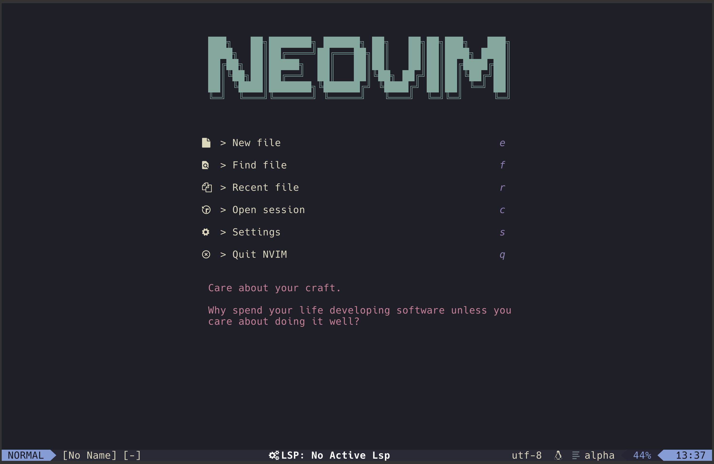
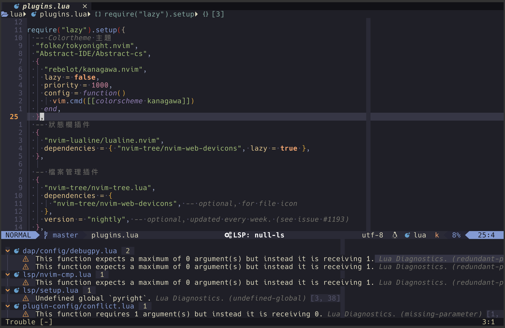

# nvim

My Neovim Config files

## Requirement

- neovim version >= 0.8
- tar & gzip(Only For Linux)
- 7zip(Only For Windows)
- curl, wget
- git
- gcc, clang, or MinGW (Only For Windows)  and libstdc++
- Microsoft C++ Build Tools(Only For Windows)
- python
- pynvim (pip packages)
- nodejs & npm (not necessary)
- neovim (npm packages) (not necessary)
- cmake (not necessary)
- ripgrep & fd & fzf

## How to Install

 Copy or use `git clone https://github.com/tangda773/algo.git`
 command to neovim config path

## Use Plugins

- Lazy.nvim
- nvim-lspconfig
- nvim-cmp
- Trouble.nvim
- mason.nvim
- Telescope.nvim
- bufferline.nvim
- lualine.nvim
- Noice.nvim
- alpha.nvim
- sniprun.nvim
- kanagawa.nvim
- nvim-dap
- null-ls.nvim
- ...

## ScreenShot

